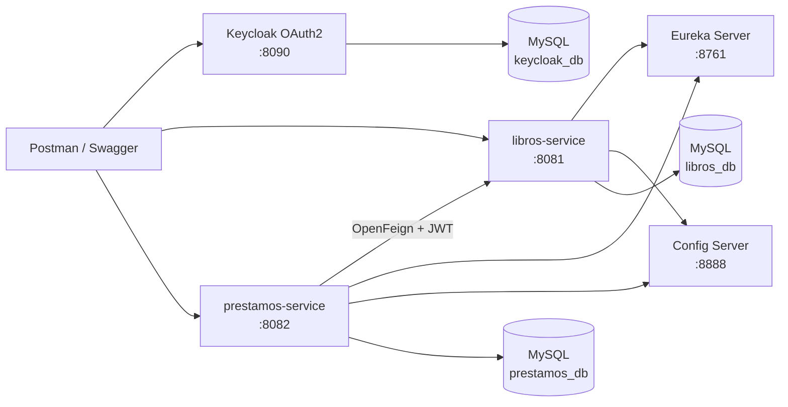

# EC3 - Microservicios de Biblioteca: Libros y Préstamos

Proyecto Maven multi-módulo listo para IntelliJ IDEA y Docker Compose. Implementa un sistema de biblioteca con catálogo de libros, préstamos, devoluciones y multa por retraso.

## Requisitos de la EC3 cubiertos

| Requisito | Implementación |
|---|---|
| Base de datos | MySQL 8.4 con esquemas separados `libros_db`, `prestamos_db` y `keycloak_db` |
| MapStruct | `LibroMapper` y `PrestamoMapper` |
| Swagger / OpenAPI | Swagger UI en los puertos 8081 y 8082, integrado con OAuth2 PKCE |
| Eureka Server | Servicio de descubrimiento en el puerto 8761 |
| Config Server | Configuración centralizada en el puerto 8888 |
| Keycloak OAuth2 | Realm, clientes, roles y usuarios importados automáticamente |
| Comunicación entre servicios | `prestamos-service` consume `libros-service` mediante OpenFeign y Eureka |
| Docker | MySQL, Keycloak, Eureka, Config Server y ambos microservicios están dockerizados |
| Postman | Colección y environment incluidos en la carpeta `postman` |
| GitHub | Incluye `.gitignore` y workflow de GitHub Actions |
| Documento Word | Se incluye una plantilla de informe lista para insertar capturas |

## Arquitectura



## Tecnologías

- Java 21
- Spring Boot 4.1.0
- Spring Cloud 2025.1.2
- Spring Cloud Netflix Eureka
- Spring Cloud Config
- Spring Cloud OpenFeign
- Spring Security OAuth2 Resource Server
- Keycloak 26.7.0
- Spring Data JPA y MySQL
- MapStruct 1.6.3
- springdoc-openapi 3.0.3
- Docker Compose

## Inicio rápido con Docker

### 1. Abrir el proyecto en IntelliJ IDEA

1. Descomprime la carpeta del proyecto.
2. Abre IntelliJ IDEA.
3. Selecciona **File > Open**.
4. Elige la carpeta `microservicios-biblioteca-ec3`.
5. Confirma **Open as Project**.
6. Espera a que IntelliJ importe el `pom.xml` raíz.
7. En **File > Project Structure > Project SDK**, selecciona Java 21.

No es necesario ejecutar cada clase desde IntelliJ para la entrega; Docker Compose inicia todo el sistema.

### 2. Iniciar todos los componentes

Desde la terminal de IntelliJ, ubicada en la raíz:

```bash
docker compose up -d --build
```

En Windows también puedes ejecutar:

```bat
scripts\iniciar.bat
```

### 3. Comprobar el estado

```bash
docker compose ps
```

Todos los servicios de aplicación deben aparecer como `healthy`. Keycloak puede aparecer como `running`.

Para revisar errores:

```bash
docker compose logs --tail=200
```

Para seguir un servicio específico:

```bash
docker compose logs -f libros-service
```

## Direcciones del sistema

| Componente | URL |
|---|---|
| Eureka Dashboard | `http://localhost:8761` |
| Config de libros | `http://localhost:8888/libros-service/default` |
| Config de préstamos | `http://localhost:8888/prestamos-service/default` |
| Keycloak | `http://localhost:8090` |
| Swagger Libros | `http://localhost:8081/swagger-ui.html` |
| Swagger Préstamos | `http://localhost:8082/swagger-ui.html` |
| Health Libros | `http://localhost:8081/actuator/health` |
| Health Préstamos | `http://localhost:8082/actuator/health` |
| MySQL desde Windows | `localhost:3307` |

## Usuarios y contraseñas

### Keycloak Admin Console

- Usuario: `admin`
- Contraseña: `admin`

Este usuario pertenece al realm `master` y administra Keycloak.

### Usuario ADMIN de la aplicación

- Realm: `biblioteca`
- Usuario: `admin`
- Contraseña: `admin123`
- Roles: `ADMIN`, `USER`

### Usuario normal

- Realm: `biblioteca`
- Usuario: `usuario`
- Contraseña: `usuario123`
- Rol: `USER`

### MySQL

- Host: `localhost`
- Puerto externo: `3307`
- Root: `root` / `root123`
- Aplicación: `biblioteca` / `biblioteca123`

## Pruebas con Swagger

1. Abre el Swagger de libros o préstamos.
2. Presiona **Authorize**.
3. Selecciona el flujo OAuth2.
4. Swagger te enviará a Keycloak.
5. Inicia sesión con `admin / admin123` o `usuario / usuario123`.
6. Autoriza y ejecuta las operaciones.

El usuario `usuario` puede consultar libros y administrar préstamos, pero no puede crear, actualizar ni eliminar libros. Para esas operaciones se requiere el rol `ADMIN`.

## Pruebas con Postman

Importa estos archivos:

- `postman/EC3-Biblioteca.postman_collection.json`
- `postman/EC3-Biblioteca-Local.postman_environment.json`

Ejecuta en este orden:

1. **Obtener token ADMIN**.
2. **Crear libro (ADMIN)**.
3. **Crear préstamo**.
4. **Verificar libro no disponible**.
5. **Registrar devolución**.
6. **Verificar libro disponible**.

La colección guarda automáticamente `access_token`, `libro_id` y `prestamo_id`.

### Flujo demostrado

Al registrar un préstamo:

1. `prestamos-service` recibe la solicitud.
2. Busca `libros-service` mediante Eureka.
3. Envía el mismo JWT mediante un interceptor Feign.
4. Consulta el libro y valida que esté disponible.
5. Guarda el préstamo en `prestamos_db`.
6. Cambia la disponibilidad del libro a `false` en `libros_db`.

Al registrar la devolución, cambia el estado a `DEVUELTO`, calcula la multa y vuelve a colocar el libro como disponible.

## Endpoints principales

### Libros - `http://localhost:8081/api/libros`

| Método | Ruta | Rol | Descripción |
|---|---|---|---|
| GET | `/api/libros` | USER / ADMIN | Listar libros |
| GET | `/api/libros/{id}` | USER / ADMIN | Buscar libro |
| POST | `/api/libros` | ADMIN | Crear libro |
| PUT | `/api/libros/{id}` | ADMIN | Actualizar libro |
| DELETE | `/api/libros/{id}` | ADMIN | Eliminar libro disponible |
| PATCH | `/api/libros/{id}/disponibilidad` | USER / ADMIN | Integración con préstamos |

Ejemplo para crear libro:

```json
{
  "isbn": "978-612-0000-01-1",
  "titulo": "Clean Code",
  "autor": "Robert C. Martin",
  "categoria": "Programación",
  "anioPublicacion": 2008
}
```

### Préstamos - `http://localhost:8082/api/prestamos`

| Método | Ruta | Rol | Descripción |
|---|---|---|---|
| GET | `/api/prestamos` | USER / ADMIN | Listar préstamos |
| GET | `/api/prestamos?estado=ACTIVO` | USER / ADMIN | Filtrar préstamos activos |
| GET | `/api/prestamos/{id}` | USER / ADMIN | Buscar préstamo |
| POST | `/api/prestamos` | USER / ADMIN | Crear préstamo |
| POST | `/api/prestamos/{id}/devolucion` | USER / ADMIN | Registrar devolución |

Ejemplo para crear préstamo:

```json
{
  "libroId": 1,
  "lectorNombre": "Carlos Pérez",
  "lectorDocumento": "76543210",
  "fechaLimite": "2026-07-27"
}
```

La multa es de **S/ 2.50 por cada día** posterior a `fechaLimite`.

## Base de datos

El script `docker/mysql/init/01-init.sql` crea automáticamente:

- `libros_db`
- `prestamos_db`
- `keycloak_db`
- usuarios y permisos correspondientes

JPA crea las tablas `libros` y `prestamos` al iniciar los microservicios.

Para ingresar desde MySQL Workbench:

- Host: `127.0.0.1`
- Puerto: `3307`
- Usuario: `root`
- Contraseña: `root123`

Consultas útiles:

```sql
USE libros_db;
SELECT * FROM libros;

USE prestamos_db;
SELECT * FROM prestamos;
```

## Ejecutar módulos desde IntelliJ sin Docker

Para una ejecución híbrida, primero inicia infraestructura:

```bash
docker compose up -d mysql keycloak eureka-server config-server
```

Después ejecuta estas clases desde IntelliJ:

- `LibrosServiceApplication`
- `PrestamosServiceApplication`

Las configuraciones incluyen valores por defecto para `localhost`. MySQL sigue usando el puerto interno 3306 en las URLs por defecto; si ejecutas los microservicios fuera de Docker, cambia temporalmente `DB_URL` a puerto 3307 en las configuraciones de ejecución de IntelliJ:

```text
libros-service:
DB_URL=jdbc:mysql://localhost:3307/libros_db?useSSL=false&allowPublicKeyRetrieval=true&serverTimezone=UTC

prestamos-service:
DB_URL=jdbc:mysql://localhost:3307/prestamos_db?useSSL=false&allowPublicKeyRetrieval=true&serverTimezone=UTC
```

## Compilar con Maven

```bash
# Windows
mvnw.cmd clean verify

# Linux / macOS
./mvnw clean verify

# También funciona con Maven instalado
mvn clean verify
```

También puedes usar la ventana **Maven** de IntelliJ y ejecutar `Lifecycle > verify` sobre el proyecto raíz.

## Detener o reiniciar

Detener conservando datos:

```bash
docker compose down
```

Eliminar también las bases y reiniciar completamente:

```bash
docker compose down -v --remove-orphans
docker compose up -d --build
```

Esto es importante si modificas el archivo del realm de Keycloak: los realms solo se importan inicialmente cuando la base está vacía.

## Capturas recomendadas para el informe Word

1. Árbol del proyecto en IntelliJ.
2. `docker compose ps` con los contenedores activos.
3. Dashboard de Eureka con `LIBROS-SERVICE` y `PRESTAMOS-SERVICE`.
4. Respuesta del Config Server.
5. Realm, roles, clientes y usuarios en Keycloak.
6. Token obtenido en Postman.
7. Crear libro con estado HTTP 201.
8. Crear préstamo con estado HTTP 201.
9. Libro con `disponible: false` después del préstamo.
10. Devolución con estado `DEVUELTO` y multa.
11. Libro con `disponible: true` después de la devolución.
12. Tablas visibles en MySQL Workbench.
13. Swagger de ambos microservicios.
14. Repositorio publicado en GitHub.

## Subir a GitHub

Crea un repositorio vacío y ejecuta desde la raíz:

```bash
git init
git add .
git commit -m "EC3 microservicios biblioteca"
git branch -M main
git remote add origin TU_URL_DEL_REPOSITORIO
git push -u origin main
```

No subas la carpeta `.idea` ni los directorios `target`; ya están incluidos en `.gitignore`.

## Solución de problemas

### Un contenedor aparece `unhealthy`

```bash
docker compose ps
docker compose logs --tail=250 NOMBRE_DEL_SERVICIO
```

### El realm no cambió después de editar el JSON

```bash
docker compose down -v
docker compose up -d --build
```

### El puerto 3307, 8081, 8082, 8090, 8761 o 8888 está ocupado

Cierra la aplicación que usa el puerto o modifica únicamente el lado izquierdo del mapeo en `docker-compose.yml`.

### Respuesta 401

Obtén un token nuevo en Postman. Los tokens expiran y deben enviarse como:

```text
Authorization: Bearer TOKEN
```

### Respuesta 403 al crear un libro

Estás usando el usuario `usuario`. Obtén el token con `admin / admin123`.

## Script SQL completo

Además del script de creación de bases y usuarios, la carpeta `docker/mysql/init` contiene `02-tablas-aplicacion.sql`, con la estructura completa de las tablas `libros` y `prestamos`. No se crea una clave foránea física entre ambas bases porque cada microservicio es propietario de sus datos; `prestamos.libro_id` es una referencia lógica validada mediante la comunicación con `libros-service`.
