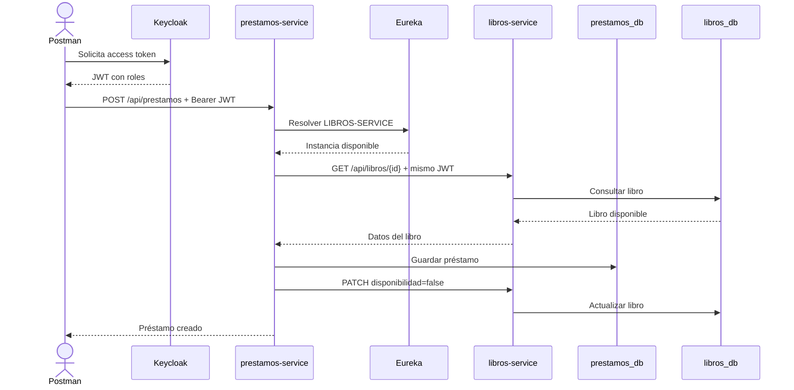
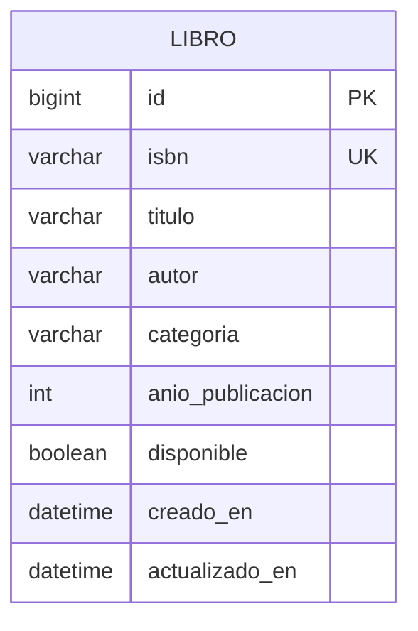
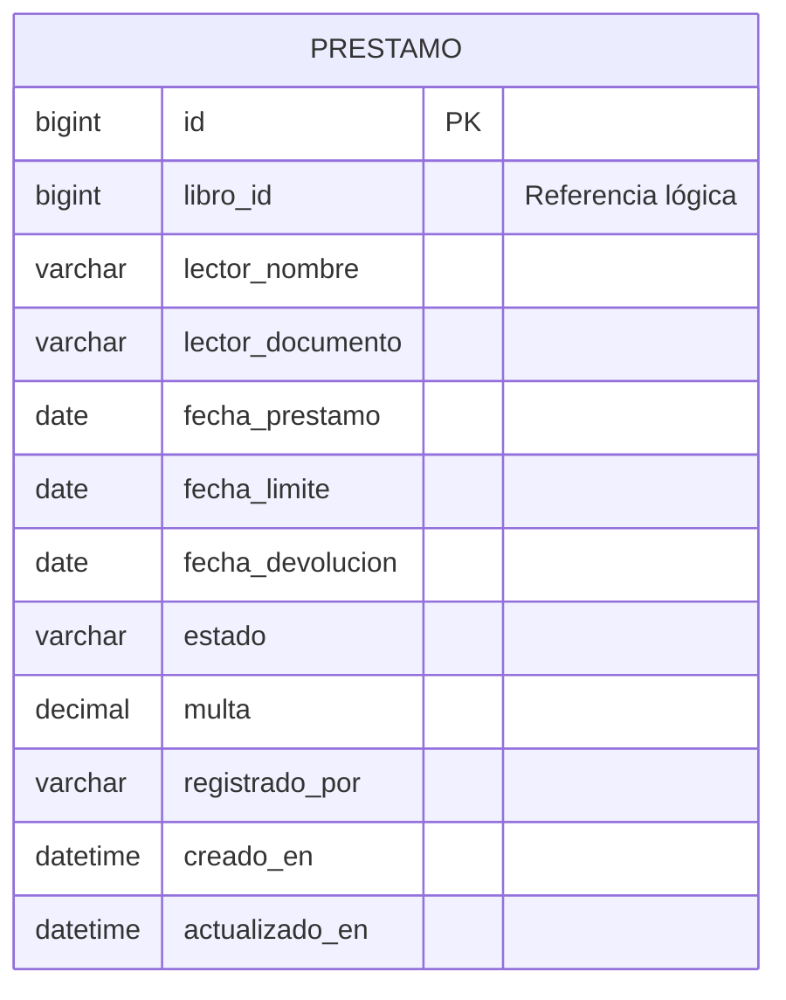

# Arquitectura y modelo de datos

## Comunicación

## Entidad Libro

## Entidad Préstamo

No existe una llave foránea física entre bases de datos de microservicios. `libro_id` es una referencia lógica validada mediante la API de libros.

